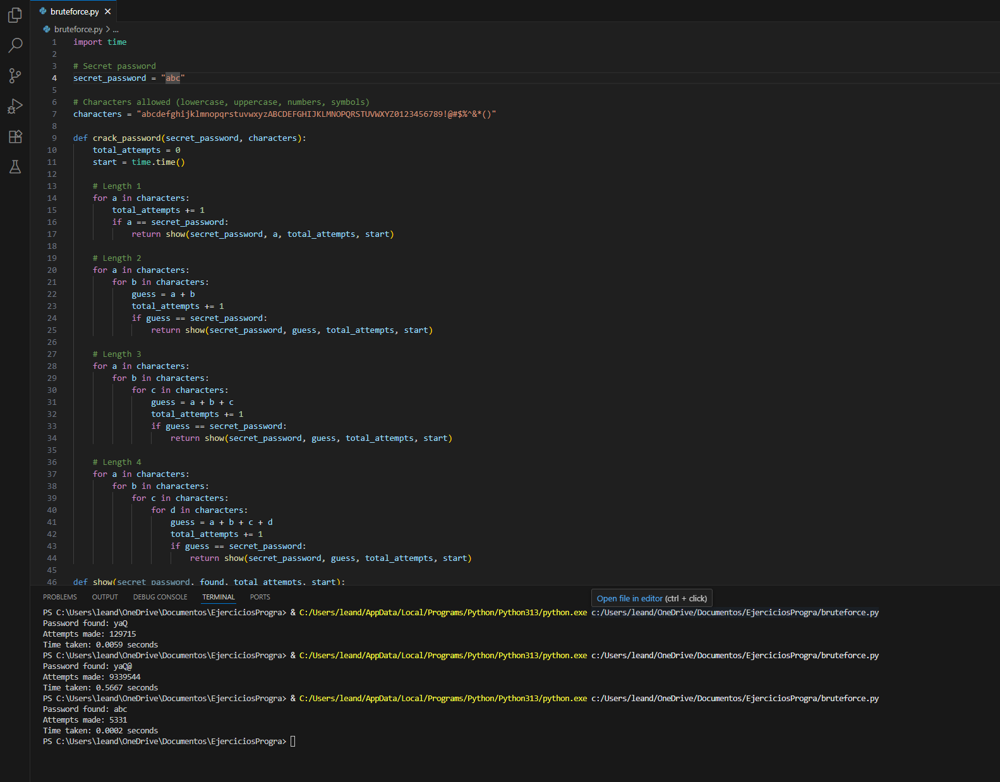

# Brute Force Password Cracker

This project implements a simple **controlled brute force** algorithm in Python to understand how password guessing attacks work and to reflect on the importance of using secure passwords.

---

## How to run the program

1. Clone this repository or download the files.
   ```bash
   git clone https://github.com/Lean131X/bruteforce-password.git
   cd bruteforce-password
2. Make sure you have Python 3 installed.
   Check with:
   ```bash
   python --version
3. Run the script:
   ```bash
   python bruteforce.py
Example output
   If the secret password is "yaQ@", the output could be:
   ```yaml
   Password found: yaQ@
   Attempts made: 9339544
   Time taken: 0.5667 seconds
   (The number of attempts and time may vary depending on your computer’s speed.)
```
Reflection

Execution time grows significantly when the password is longer or when the alphabet includes more characters (uppercase, numbers, symbols).

The interesting part came when I added uppercase letters, numbers, and symbols. The number of attempts grew so much that it made me realize why people always say we should use complex passwords. With every new character, the difficulty increases a lot.  

What I take from this activity is that even a beginner script like mine can expose how weak a simple password really is. From now on, I’ll be more careful with my own passwords, and I also understand better why websites insist on using at least 8 characters, a number, and a symbol that it really makes a big difference.


Repository files:

bruteforce.py: Main script with the brute force algorithm.

README.md: Documentation with instructions, examples, and reflection.


##  Demo screenshot



